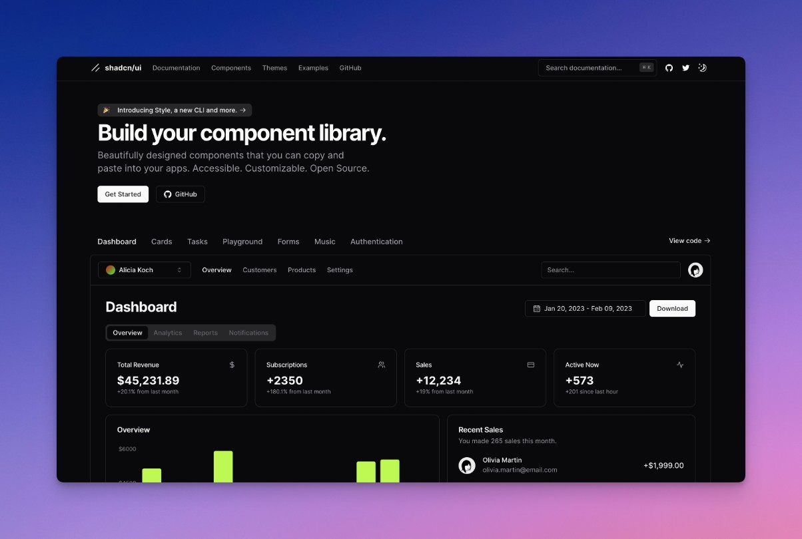

[](https://shadcn-nuxt-starter.xdesign.tech)

🌐 Preview: [https://shadcn-nuxt-starter.xdesign.tech](https://shadcn-nuxt-starter.xdesign.tech)

# Shadcn Nuxt Starter

Starter built with Nuxt 3 + Shadcn-ui + UnoCSS + TypeScript.

⚡️ Easy to build fast, SEO-friendly and scalable web applications, including:

- **SaaS** - Server-side Rendering (SSR)
- **Docs** - Static Site Generation (SSG)
- **Dashboard** - Client Side Rendering (CSR)

### Variations (coming soon)

- Shadcn-vue-starter - Vite Starter Template

## 🔥 Features

This is a starter template using the following stack:

- ⛰️ [Nuxt 3](https://nuxt.com/) - SSR, SSG, CSR, File-based routing, components auto importing, (compatibilityVersion: 4), etc.

- 🎨 [Shadcn-vue](https://github.com/radix-vue/shadcn-vue) - Beautifully designed re-usable components built with Radix Vue.

- ⚡️ Vite - Instant HMR.

- 🌈 [UnoCSS](https://github.com/unocss/unocss) - The instant on-demand atomic CSS engine.

- 😃 [Iconify](https://iconify.design/) - Over 200,000 open source vector icons.

- 🍍 [Pinia](https://github.com/vuejs/pinia) - State Management.

- 🤖 The `<script setup>` syntax.

- 🦾 TypeScript, of course.

- 💨 Zero-config cloud functions and deploy.

Built-in feature from Next.js:

- 🔍 SEO Optimization and Meta tags definition.

- 📝 Markdown Support

- 🖥️ File based routing.

- 📑 [Layout system](./app/layouts).

- 📥 Auto importing - for Composition API, VueUse and custom composables.

- 📲 [PWA](https://github.com/vite-pwa/nuxt) with offline support and auto-update behavior.

## 🚀 Getting started

### Requirements

- Node.js 18+ and pnpm

### Development

1. Clone the repository:

```shell
git clone https://github.com/xdesign-dev/shadcn-nuxt-starter.git project-name
cd project-name
```

2. Install dependencies:

```shell
pnpm install
```

3. Then, you can run locally in development mode with live reload:

```shell
pnpm dev
```

### Build

To build the App, run

```shell
pnpm build
```

## 💎 Credits

All credits go to these open-source works and resources

- [Nuxt](https://nuxt.com) for creating this beautiful project.
- [Radix Vue](https://radix-vue.com) for doing all the hard work to make sure components are accessible.
- [antfu](https://github.com/antfu) for vitesse and vitesse-nuxt.
- [VueUse](https://vueuse.org) for providing many useful utilities.

## License

Licensed under the [MIT license](LICENSE).
